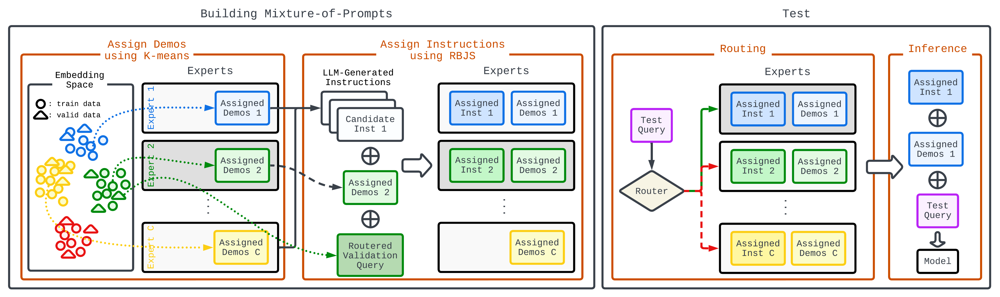

## One Prompt is not Enough: Automated Construction of a Mixture-of-Expert Prompts - ICML 2024


<br>


This repository contains the official implementation of our [MoP](https://arxiv.org/abs/2407.00256), accepted by ICML 2024.
> [**[ICML 2024] One Prompt is not Enough: Automated Construction of a Mixture-of-Expert Prompts**](https://arxiv.org/abs/2407.00256)<br>
> Authors: 
> [Ruochen Wang*](https://ruocwang.github.io/), 
> [Sohyun An*](https://cownowan.github.io/),
> [Minhao Cheng](https://cmhcbb.github.io/),
> [Tianyi Zhou](https://tianyizhou.github.io/),
> [Sung Ju Hwang](http://www.sungjuhwang.com/),
> [Cho-Jui Hsieh](https://web.cs.ucla.edu/~chohsieh/)<br>
> Presented by **[TurningPoint AI](https://www.turningpoint-ai.com/) - UCLA - UMD - PSU - KAIST**


## About MoP

Mixture-of-Prompts (MoP) is the first **prompt optimization framework** that extends the Mixture-of-Expert paradigm to Prompt Optimization. Unlike traditional methods that optimize a single prompt, MoP optimizes a mixture of prompts (experts) with different specialties, each tailored to only handle queries belong to a partition of the entire problem space. In addition, MoP also jointly optimizes the instruction and In-Context demos field of the prompt for each expert. Designed as a plug-and-play solution, MoP is compatible with various prompt generation algorithms, including [APE](https://arxiv.org/abs/2211.01910), [InstructZero](https://arxiv.org/abs/2306.03082), etc. Our extensive empirical study on 55 tasks across three major benchmarks, one of the largest of its kind, demonstrates that MoP achieves an average win rate of 81% over comparable baselines. Dividing the problem space into sub-regions also benefits the performance on Out-Of-Distribution data.

<table class="center">
    <tr>
    <td width=100% style="border: none"></td>
    </tr>
    <tr>
    <td width="100%" style="border: none; text-align: left; word-wrap: break-word"><b>Overview of MoP pipeline.</b> We adopt the MoE paradigm and divide the problem space into a set of sub-regions. Each sub-region is governed by a specialized expert, equipped with both an instruction and a set of demos. A two-phase process is developed to construct the specialized expert for each region: (1) demo assignment: Inspired by the theoretical connection between ICL and kernel regression, we group demos into experts based on their semantic similarity; (2) instruction assignment: A region-based joint search (RBJS) of an instruction per expert complements the demos assigned to it, yielding a synergistic effect. During inference, each new query is routed to its closest expert in the embedding space and the assigned expert then utilizes its prompt (instruction + demos) to make the final prediction.
</td>
  </tr>
</table>


## Preparations

**1. Set environment**

All commands are stored in `scripts/install_env.sh`. If you wish to run InstructZero (iz), run the following installation script as well `scripts/install_env_iz.sh`.

**2. OpenAI account**

Our experiments are conducted using `gpt-3.5-turbo-instruct` model from OpenAI. To use OpenAI API services, you can set the OpenAI Key in `scripts/run.sh` file.

**3. Download benchmarks**

Our experiments are conducted on Instruction Induction Benchmark, SuperNature Instruction Benchmark and Big-Bench Hard. Your can download our preprocessed data files [HERE](https://drive.google.com/drive/folders/1Xeja0HYPONy513LL1gU7u6s9DXxjhWfK?usp=sharing), and place them at `mop/benchmarks/` (for example `mop/benchmarks/superni`)


## Run MoP

### Quick start
Run the following script to verify your setups
```bash
bash run-mop-fast.sh
bash run-ape-kcen-fast.sh
bash run-iz-kcen-fast.sh
```

### Instruction Induction Benchmark

```bash
bash run.sh --method mop --benchmark ii --datasets [0-24]
```

Below are the key fields inside `run.sh`:
- `--method` specifies the prompt optimization algorithm.
- `--benchmark` is the evaluation benchmark, including `ii` (Instruction Induction*), `sni` (SuperNatural Instructions), and ``
- `--datasets` is the task_id. You can run on multiple datasets sequentially using comma-separated format (e.g. 1,2,3,4). These benchmarks comprises of hundreds of tasks and it is expensive to evaluate on all of them. We filter around 10-20 tasks from each benchmark, focusing on the challenging ones such as math/coding problems, and those cannot be resolved with a simple prompt (More details in the Appendix).
- `--n_experts` is the maximum number of experts. The actual number of expert will be decided by the Kauto algorithm during demo assignment phase.


### SuperNature Instruction Benchmark

```bash
bash run.sh --method mop --benchmark sni --datasets 0-19
```

### Big-Bench Hard

```bash
bash run.sh --method mop --benchmark bbh --datasets 0-9
```


## Run Baselines
To run the baselines, simply change the `--method` field of the above commands
```
bash run.sh --method ape
bash run.sh --method ape-random
bash run.sh --method ape-kcen

bash run.sh --method iz
bash run.sh --method iz-random
bash run.sh --method iz-kcen
```


# 📖BibTeX
```
@inproceedings{wang2024one,
  title={One Prompt is not Enough: Automated Construction of a Mixture-of-Expert Prompts},
  author={Wang, Ruochen and An, Sohyun and Cheng, Minhao and Zhou, Tianyi and Hwang, Sung Ju and Hsieh, Cho-Jui},
  booktitle={International Conference on Machine Learning},
  year={2024}
}
```
